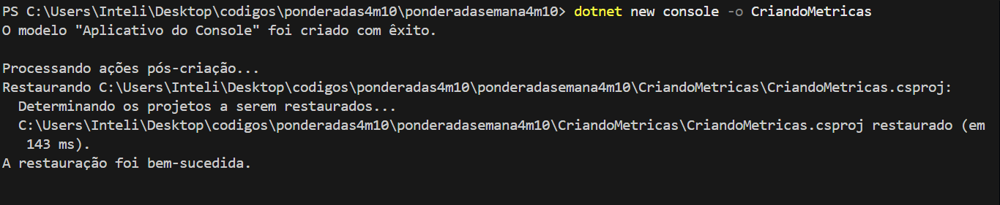
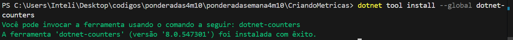
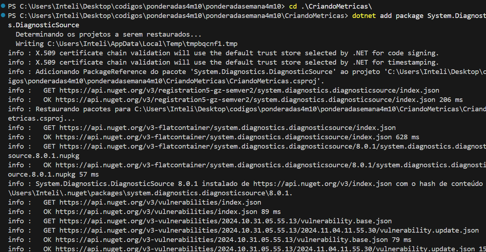
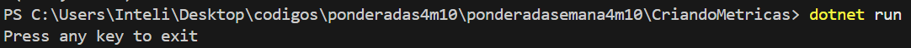
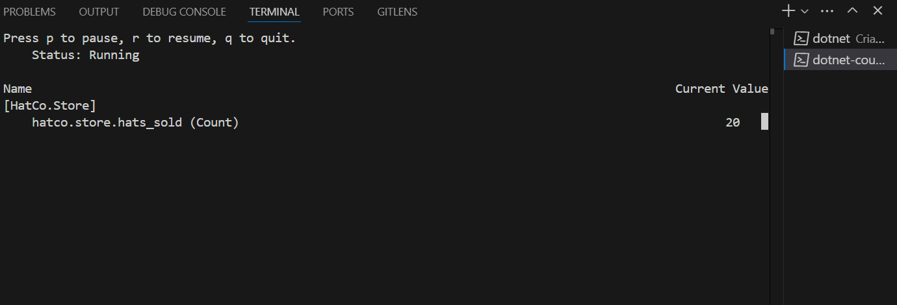

# Relatório de Implementação de Métricas com .NET

## Introdução às Métricas

Métricas são fundamentais para a qualidade de software, pois permitem a avaliação objetiva do desempenho e da eficiência de um sistema. Elas ajudam a identificar áreas que necessitam de melhoria, a monitorar o progresso de desenvolvimento e a garantir que as expectativas dos usuários sejam atendidas. No contexto de qualidade de software, métricas podem incluir aspectos como tempo de resposta, taxa de erros, e, neste caso específico, contadores que registram eventos significativos, como vendas. Ao integrar métricas em um aplicativo, os desenvolvedores conseguem obter insights valiosos sobre o comportamento do software em tempo real.

## 1. Configuração do Ambiente

Para iniciar, é necessário ter o .NET SDK instalado em sua máquina. Você pode baixar o instalador do .NET no site oficial:

- [Download do .NET](https://dotnet.microsoft.com/download)

Após a instalação, abra o terminal ou o prompt de comando e crie um novo projeto console utilizando o seguinte comando:

```bash
dotnet new console -n CriandoMetricas
```




## Instalação dos Pacotes e Ferramentas

Para utilizar métricas, precisamos adicionar o pacote System.Diagnostics.DiagnosticSource ao projeto. Execute o seguinte comando na pasta do projeto:

```bash
dotnet add package System.Diagnostics.DiagnosticSource
```
```bash
dotnet tool install --global dotnet-counters
```







## Configuração do arquivo Program.cs

No arquivo Program.cs, o seguinte código foi implementado:

using System;
using System.Diagnostics.Metrics;
using System.Threading;

class Program
{
    static Meter s_meter = new Meter("HatCo.Store");
    static Counter<int> s_hatsSold = s_meter.CreateCounter<int>("hatco.store.hats_sold");

    static void Main(string[] args)
    {
        int totalHatsSold = 0;  // Variável para acompanhar o total de chapéus vendidos

        Console.WriteLine("Press any key to exit");

        while (!Console.KeyAvailable)
        {
            // Simula uma venda de 4 chapéus a cada segundo
            Thread.Sleep(1000);
            s_hatsSold.Add(4);
            totalHatsSold += 4;  // Atualiza o total de chapéus vendidos

            Console.WriteLine($"Total hats sold: {totalHatsSold}");  // Imprime o total no console
        }
    }
}

## Execução do Program.cs

Após configurar o código, o próximo passo é executar o projeto. No terminal, navegue até o diretório do projeto e execute:

```
dotnet run
```



## Execução do Monitoramento das Métricas

Durante a execução da aplicação, o contador de chapéus vendidos será atualizado a cada segundo. O console exibirá a mensagem com o total de vendas




## Conclusão

O monitoramento de métricas é um aspecto crucial no desenvolvimento de software, pois fornece visibilidade sobre o desempenho e o comportamento do sistema em tempo real. Através da implementação de contadores e outras métricas, conseguimos captar informações valiosas sobre eventos significativos, como as vendas de chapéus no nosso exemplo. Esse tipo de monitoramento permite que os desenvolvedores identifiquem tendências, avaliem a eficácia de funcionalidades e tomem decisões informadas para otimizar o desempenho do software.
